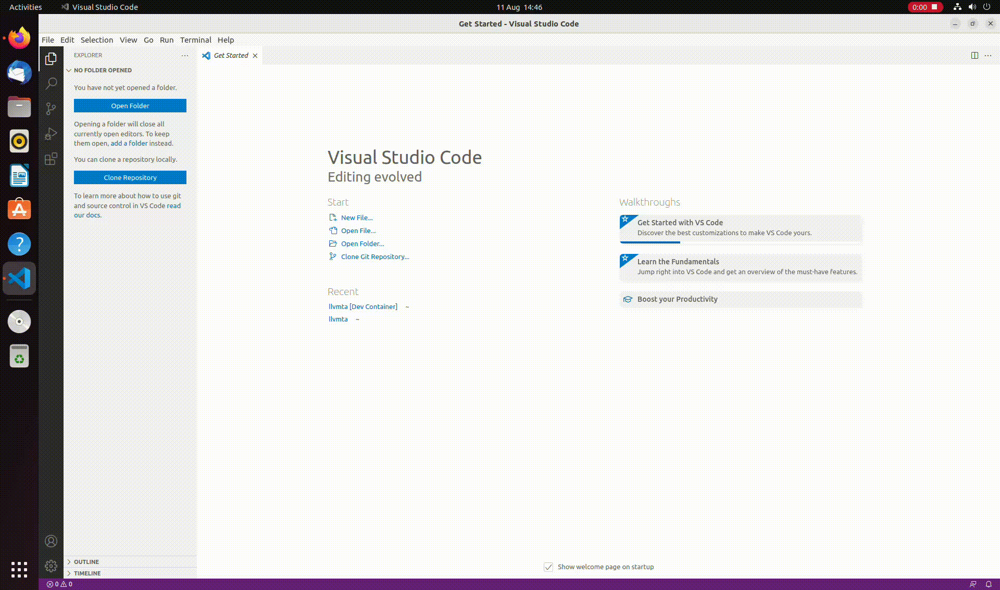
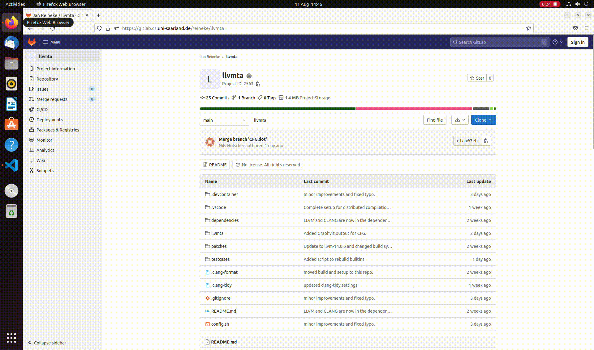

# NVM Simulation
This Repository should enable the user to use our Gem5 + NVMain2.0 setup, Unikraft and Benchmark apps to measure/evaluate NVM memory.

<!-- ## Setup the repository
After cloning the repository, please make sure to execute the following in it:
```
git submodule init
git submodule update
```
This will ensure all required submodule are present and updated. -->

## Setup with VS Code and Docker development container
1.) Get [VS CODE](https://code.visualstudio.com/) and necessary [extensions](https://code.visualstudio.com/docs/remote/remote-overview) for remote container development. Also make sure Docker is installed on your system and that docker commands can be executed by non-root users. We recommend installing docker via [their repository](https://docs.docker.com/engine/install/ubuntu/#install-using-the-repository) and also following their [post-installation guide](https://docs.docker.com/engine/install/linux-postinstall/).



2.) This repository supports VS code development containers. Just open the repository folder and VS code should prompt you an information that you can reopen the folder in a docker container instead. Agree and continue with [initializing](#using-the-benchmarks). Alterantivley, click the blue "Remote Window" icon in the bottom left of VS code and select "Reopen folder in container".



## Prerequisites on your computer for `CDNC CIM Full-System` simulation part

1- **KVM**-supported cpu: Without this, loading the operating system in gem5 will take significantly longer.

2- Install **KVM** packages:
- follow instructions on https://help.ubuntu.com/community/KVM/Installation (or a similar guide for your OS distribution)

## Using the simulation
The NVMBench.sh script provides you with the most basic tools to setup and use Gem5/NVMain2.0/Unikraft/Benchmarks. Make sure to modify it in order to fit your needs, e.g. to setup the correct memory configuration.

### Enable / Disable features
You can decide which features to enable before building the simulation. In NVMBench.sh, transform
```
python3 `which scons` -j 8 EXTRAS=../nvmain ./build/ARM/gem5.fast
```
e.g. to
```
python3 `which scons` tu_dortmund=1 -j 8 EXTRAS=../nvmain ./build/ARM/gem5.fast
```
to enable all features from TU Dortmund.

Currently the following features are supported:  
tu_dortmund: Bit-Flip Trace Writer  
CDNCcim: Compute in Memory module for NVM technologies

### Build the simulation
Before running the simulation (Gem5 + NVMain2.0) it needs to be build with:
```
./NVMBench.sh fb
```
Please make sure you are in the directory NVMBench.sh is in. Alterantivly, use Ctrl+Shift+B in VS code to build the simulator.

### Prepare the benchmarks
All benchmark apps in unikraft_setup/apps/ should be configured already, however they can be configured again by using:
```
./NVMBench.sh c APPNAME
```
For more information see the Unikraft documentation.

The apps can be build with:
```
./NVMBench.sh ba APPNAME
```

### Running the simulation
Start the simulation with:
```
./NVMBench.sh e APPNAME
```
Simulation results will be dumped in the results/APPNAME.d folder.
The simulation starts detached from the terminal. The gem5 output is located in results/APPNAME.d/gem5.terminal. The unikraft terminal output is located at results/APPNAME.d/m5out/system.terminal

### TL;DR:
Execute only once after cloning the repository:
```
git submodule init
git submodule update
```

To run the simulation:
```
./NVMBench.sh fe APPNAME
```

Results are in: results/APPNAME.d/
